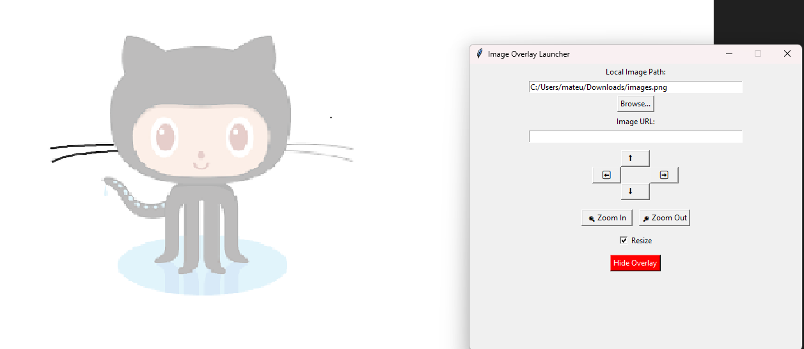

# Image-Overlay

A small Tkinter utility that creates a semi-transparent, always-on-top image overlay you can position and resize above other windows — perfect for **shadowing reference images to practice drawing**. Use it to trace, reproduce, or compare your artwork directly on top of your drawing app or paper.
---



# Features

* Load an image from a **local path** or from an **image URL**. 
* Create a **click-through**, semi-transparent overlay window (Windows only) so you can draw in the app beneath while seeing the reference. 
* Move overlay with on-screen arrow buttons (press & hold to continue moving). 
* Zoom in / Zoom out (resizes the overlay). 
* Toggle between **resized fit** and **original image** with a checkbox. 
* Hide overlay quickly (Escape key also closes it). 

---

# Requirements

* **Python 3.8+** (recommended).

* Packages:

  ```bash
  pip install pillow requests
  ```

  (`tkinter` is part of the standard library on most systems — on some Linux distributions it is provided by a separate package, e.g. `sudo apt install python3-tk`.)

* Tested on **Windows** for click-through overlay support (the click-through / layered window code uses Win32 API via `ctypes`). On non-Windows OSes the overlay still works but the click-through feature is skipped. 

---

# Quick start

1. Install dependencies:

   ```bash
   pip install pillow requests
   ```
2. Run the script:

   ```bash
   python image_overlay.py
   ```
---
